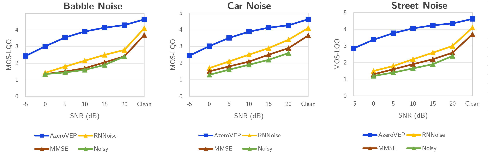
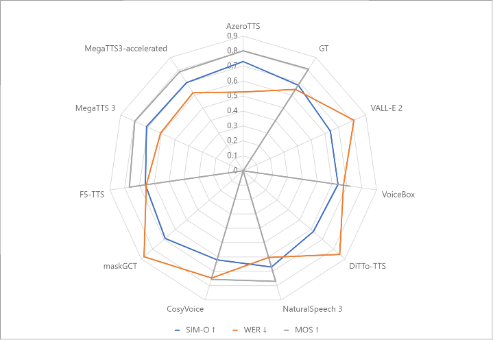
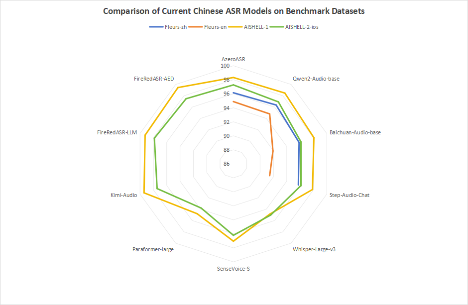

# Azero Acoustic Model Testing Scripts

This repository contains scripts and instructions for testing Azero acoustic models, including AzeroVEP, AzeroTTS, and AzeroASR. The experimental environment, datasets, and evaluation methods are detailed below and align with the reproducibility guidelines provided in the appendix of our research paper.

---------
## [1] azero-gvep-test - azerovep model test scripts
---------
### mix_with_noise.py
+ desc: Mixes a speech file with background and foreground noise to generate a synthesized audio file.
+ run example：python mix_with_noise.py \
        --clean_path xxx.pcm \
        --background_noise_path xxx.pcm \
        --foreground_noise_path xxx.pcm \
        --output_file_path xxx

### get_gvep_result.py
+ desc: Invokes the Azero GVEP model API to process audio files and returns the enhanced output results.
+ run example: python get_gvep_result.py \
        --input_file xxx \
        --trim_duration 600 \
        --output_file xxx
+ to get api token, visit: https://azero.soundai.com/#/voice?id=denoise

### get_test_result.py
+ desc: Analyzes and compares the GVEP model output with reference files to generate test evaluation results.
        Ensure that the audio files are in the same format.
+ run example: python get_test_result.py \
        --gvep_path xxx \
        --answer_path xxx \
        --output_file xxx.txt

### PESQ MOS-LQO Quality Evaluation for Babble, Car, Street Noise

  

---------
## [2] azero-gtts-test - azerotts model test scripts
---------
### get_gtts_result.py
+ desc: Invokes the Azero GTTS model API to convert text into speech with specified speaker voice.
+ run example：python test_gtts_api.py \
        --file_path xxx \
        --speaker_name "20250416000002_test_en_123456" \
        --text "A cold, bright moon was shining with clear sharp lights and shadows."
+ to get api token, visit: https://azero.soundai.com/#/voice?id=ntts_clone

### get test results via github repos blow:
+ MOS calculation  https://github.com/gabrielmittag/NISQA
+ SIM-O calculation  https://github.com/microsoft/UniSpeech/tree/main/downstreams/speaker_verification
+ Transcription of generated speech to calculate WER https://github.com/facebookresearch/fairseq/tree/main/examples/hubert

### Results on the LibriSpeech test-clean set following NaturalSpeech 3

  

---------
## [3] azero-gasr-test - azeroasr model test scripts
---------
### get_gasr_result.py
+ desc: Invokes the Azero GASR model API to perform speech recognition and convert speech into text.
+ run example：python get_gasr_result.py --file_path xxx --language xxx
+ to get api token, visit: https://azero.soundai.com/#/voice?id=asr_one_sentence

### get_test_result.py
+ desc: Analyzes the GASR model output logs to generate test evaluation results and performance metrics.
+ run example：python get_test_result.py --log_file xxx --reference_file xxx

### Performance comparison with mainstream ASR models

  

---------
## [4] AzeroGPT
---------
### Performance Scores of AzeroGPT across Diverse Evaluation Criteria

| Evaluation  Name | Single Test Item | Score | Single Test Item  | Score | Ranking |
| :--------------- | ---------------- | ----- | ----------------- | ----- | ------- |
| Livebench        | Global Average   | 32.7  | Reasoning Average | 24.47 | 43      |
|                  | IF Average       | 59.31 | average           | 32.7  |         |
| MMLU-Pro         | Overall          | 63.07 | Health            | 66.5  | 54      |
|                  | Biology          | 82.15 | History           | 66.93 |         |
|                  | Business         | 66.67 | Law               | 45.87 |         |
|                  | Chemistry        | 50.8  | Math              | 63.29 |         |
|                  | Computer Science | 66.83 | Philosophy        | 62.12 |         |
|                  | Economics        | 73.93 | Physics           | 57.51 |         |
|                  | Engineering      | 48.28 | Psychology        | 75.06 |         |
|                  | Other            | 65.91 | average           | 63.66 |         |
| C-Eval           | Avg(Hard)        | 70.4  | Humanities        | 88.4  | 3       |
|                  | STEM             | 82    | Others            | 90.4  |         |
|                  | Social Science   | 92.9  | Avg               | 87.2  |         |
| Livebenchcode_v5 | pass             | 12.1  | medium            | 5.4   | 32      |
|                  | easy             | 43.1  | hard              | 0.1   |         |

## [5] Evaluation Methods
+ MOS Calculation: [NISQA GitHub Repository](https://github.com/gabrielmittag/NISQA)
+ SIM-O Calculation: [UniSpeech GitHub Repository](https://github.com/microsoft/UniSpeech/tree/main/downstreams/speaker_verification)
+ Transcription of Generated Speech: [HuBERT GitHub Repository](https://github.com/facebookresearch/fairseq/tree/main/examples/hubert)

## [6] Evaluation Dataset

- **LibriSpeech**: A 1,000-hour corpus of 16 kHz English read speech from audiobooks.  
  Download: [OpenSLR SLR12](https://www.openslr.org/12) :contentReference[oaicite:0]{index=0}

- **AISHELL-1**: A 170-hour Mandarin speech corpus (400 speakers, 16 kHz) for ASR research.  
  Download: [OpenSLR SLR33](https://www.openslr.org/33) :contentReference[oaicite:1]{index=1}

- **AISHELL-2**: A 1,000-hour clean read-speech Mandarin dataset for industrial-scale ASR.  
  Download: [AISHELL-2 official site](http://www.aishelltech.com/aishell_2) :contentReference[oaicite:2]{index=2}

- **FLEURS**: An n-way parallel speech dataset in 102 languages (~12 h per language) for multilingual ASR and evaluation.  
  Download: [google/fleurs on Hugging Face](https://huggingface.co/datasets/google/fleurs) :contentReference[oaicite:3]{index=3}

- **Common Voice**: A massive, community-contributed multilingual speech dataset with validated recordings.  
  Download: [Mozilla Common Voice datasets](https://commonvoice.mozilla.org/datasets) :contentReference[oaicite:4]{index=4}
